<div align="center">


# AORA ENGINE
### AI Powered Stock Intelligence & Automated Trading Platform

[](https://www.python.org)
[](https://fastapi.tiangolo.com)
[](https://react.dev)
[](https://www.typescriptlang.org)
[](https://firebase.google.com)
[](https://firebase.google.com/docs/firestore)
[](https://deepmind.google/technologies/gemini)
[](https://upstox.com/developer/api)
[](https://core.telegram.org/bots)
[](https://opensource.org/licenses/MIT)
[](https://github.com/Zayannnnn/market-analyser)

</div>

---

AORA (Apex Stock Intelligence Engine) is a production-grade, multi-agent AI investment manager and automated trade execution platform built specifically for the Indian equity markets (NSE/BSE). Powered by Google Gemini 2.5 Flash and connected directly to the Upstox v2 API, AORA automates the entire trading lifecycle: scraping news, calculating indicators, generating AI summaries, evaluating risk guardrails, and placing live trades based on custom safety modes.

---

## 📌 Table of Contents

* [1. System Overview](#1-system-overview)
* [2. System Topologies (11 Mermaid Flowcharts)](#2-system-topologies-11-mermaid-flowcharts)
* [3. Technology Stack](#3-technology-stack)
* [4. Repository Folder Structure](#4-repository-folder-structure)
* [5. Environment Variables Guide](#5-environment-variables-guide)
* [6. REST API Reference](#6-rest-api-reference)
* [7. Firestore Database Schema](#7-firestore-database-schema)
* [8. Security Architecture](#8-security-architecture)
* [9. Cost Optimization & API Caching](#9-cost-optimization-api-caching)
* [10. AI Engine Decision Tree](#10-ai-engine-decision-tree)
* [11. OS Installation Guides](#11-os-installation-guides)
* [12. Troubleshooting Manual](#12-troubleshooting-manual)
* [13. Developer Extension Manual](#13-developer-extension-manual)
* [14. Project Roadmap](#14-project-roadmap)
* [15. Contributors & License](#15-contributors--license)

---

## 1. System Overview

AORA continuously tracks stock symbols, executing a data flow that evaluates trading opportunities, coordinates reviews, and executes orders:

$$\text{News Scrapes} \rightarrow \text{Quotes Polls} \rightarrow \text{AI Sentiment Analysis} \rightarrow \text{Technical Indicators Math} \rightarrow \text{Weighted Leaderboard Ranking} \rightarrow \text{Risk Controls} \rightarrow \text{Live Execution} \rightarrow \text{Telegram Notification} \rightarrow \text{React Dashboard Update}$$

---

## 2. System Topologies (11 Mermaid Flowcharts)

### 2.1 Complete System Architecture
Decoupled serverless integration connecting frontends, backends, databases, and APIs:

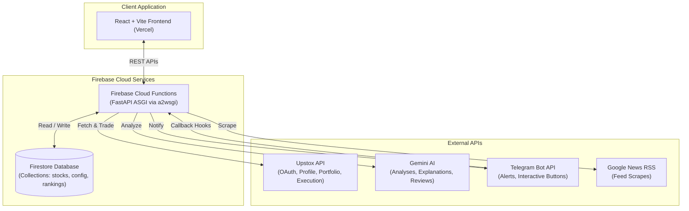

---

### 2.2 Cooperative AI Agent Pipeline
Chained cooperative workflow compiling signals and reviews:

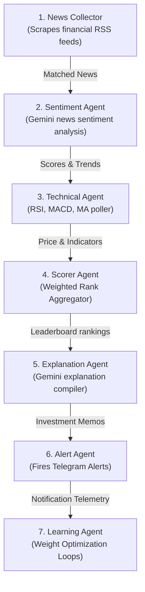

---

### 2.3 News Analysis Pipeline
Scraping, matching, and sentiment processing:

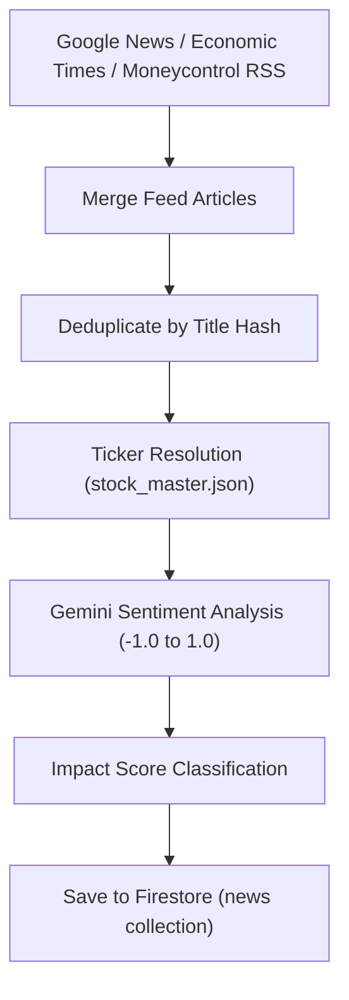

---

### 2.4 Trading Engine Architecture
Decoupled live execution flow:

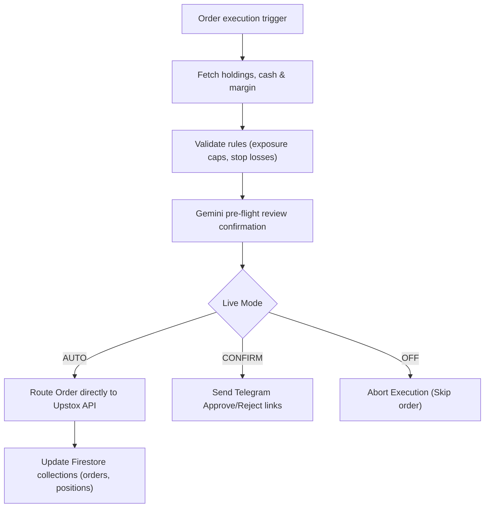

---

### 2.5 Scheduler Flow
 AP scheduler loops and cron schedules:

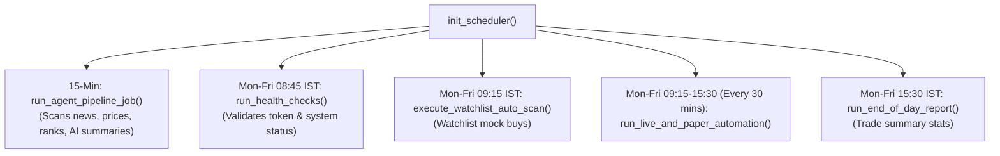

---

### 6. Firestore Database Layout
Document collections relations structure:

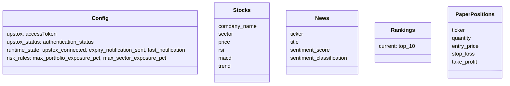

---

### 2.7 API Architecture Flow
FastAPI route routing categories:

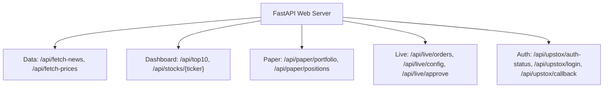

---

### 2.8 Authentication Flow
Upstox v2 OAuth validation sequence:

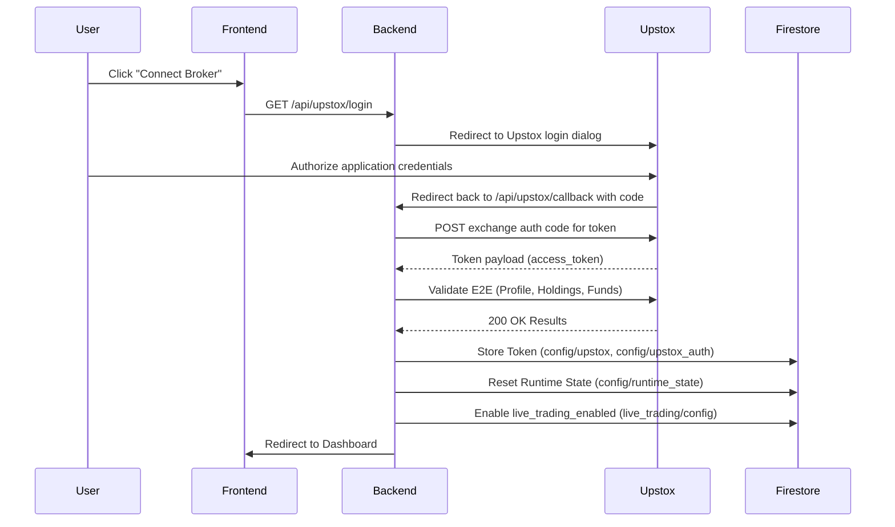

---

### 2.9 Telegram Alert Flow
Decoupled alert gateway:

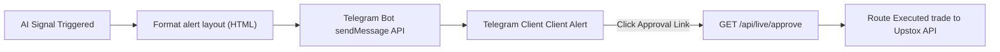

---

### 2.10 Deployment Architecture
Vercel + Cloud Run production deployments:

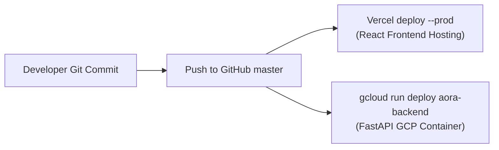

---

### 2.11 Risk Engine Flow
Guardrails check pipeline:

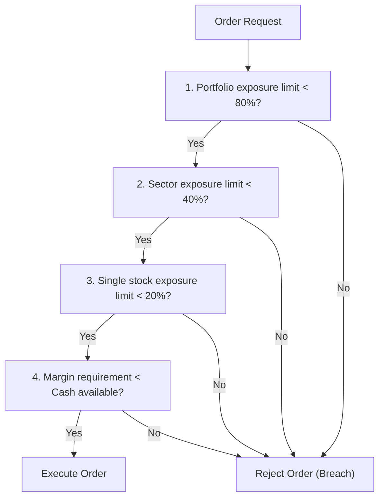

---

## 3. Technology Stack

### Frontend Stack
* **Vite / React** (v5.2 / v19.2) - Next-generation compiler and UI library.
* **TypeScript** (v6.0) - Static type checking.
* **Lightweight Charts** (v5.2) - Interactive price chart plotting.
* **Tailwind CSS** (v4.3) - Utility styling layout.

### Backend Stack
* **FastAPI** (v0.111.0) - High-performance Python ASGI web application framework.
* **a2wsgi** (v1.10.10) - WSGI-to-ASGI wrapper enabling serverless Cloud Functions deployments.
* **APScheduler** (v3.10.4) - Background task runner.

### Services & API Integration
* **Firebase Firestore** (Admin SDK v6.5) - Scalable NoSQL real-time document store.
* **Google Generative AI** (v0.7.0) - Gemini 2.5 Flash model client.
* **Upstox API** (v2) - Indian brokerage execution REST API.
* **Telegram Bot API** - Alert gateways.

---

## 4. Repository Folder Structure

```
├── .firebaserc                     # Target Firebase project identifier
├── firebase.json                   # Firebase Hosting configurations
├── deploy.ps1                      # Powershell production deployment scripts
├── backend/
│   ├── main.py                     # Functions onRequest wrapper entrypoint
│   ├── requirements.txt            # Python library specifications
│   ├── runtime.txt                 # Specifies python-3.12 deployment env
│   ├── .python-version             # Python version pin
│   └── app/
│       ├── main.py                 # FastAPI endpoints registry
│       ├── config.py               # Settings loader
│       ├── db.py                   # Firestore Client initializer
│       ├── scheduler.py            # AP Background scheduler loops
│       ├── ticker_registry.py      # Stock master registry query service
│       ├── agents/
│       │   ├── news_collector.py   # Scrapes RSS feeds
│       │   ├── sentiment.py        # Gemini news sentiment evaluator
│       │   ├── technical.py        # Polls technical price signals
│       │   └── ranking.py          # Leadership scoring aggregator
│       └── services/
│           ├── risk_engine.py      # Core rules and parameters validator
│           ├── live_execution.py   # Upstox routing engine
│           ├── health_monitor.py   # Expiry checking and safety controls
│           └── upstox_trading.py   # REST wrappers for trading endpoints
└── frontend/
    ├── package.json
    ├── vite.config.js
    └── src/
        ├── App.tsx                 # Core UI routing manager
        └── components/
            ├── PortfolioIntelligence.tsx   # Asset health and recommendation lists
            └── LiveExecution.tsx           # Risk settings and order logs
```

---

## 5. Environment Variables Guide

The backend loads configuration parameters from `backend/.env` during initialization:

* `GEMINI_API_KEY` (Required): API key for Gemini AI.
* `TELEGRAM_BOT_TOKEN` (Optional): bot token provided by `@BotFather`.
* `TELEGRAM_CHAT_ID` (Optional): user chat, group, or channel ID.
* `UPSTOX_API_KEY` (Optional): Upstox developer portal client API key.
* `UPSTOX_SECRET` (Optional): Upstox developer portal client secret.
* `UPSTOX_REDIRECT_URI` (Optional): OAuth redirect path matching the broker's registered callback.
* `DASHBOARD_URL` (Optional): Frontend landing URL returned upon completing the OAuth authentication redirect.

---

## 6. REST API Reference

See the [API Guide](./docs/api_reference.md) for JSON schemas.

### 6.1 Leadership Leaderboard API
* **Method**: `GET`
* **URL**: `/api/top10`
* **Response**: Returns current ranked list, technical indicators, news impact scores, and Gemini explanation growth summaries.

### 6.2 Upstox Connection Status
* **Method**: `GET`
* **URL**: `/api/upstox/auth-status`
* **Response**: Returns connection stats (`CONNECTED`, `EXPIRED`, `CONNECTING`, `ERROR`), token age, expected expiry, and public OAuth redirection url.

### 6.3 Risk Configs Endpoint
* **Method**: `GET` / `POST`
* **URL**: `/api/trading/risk-rules`
* **Request (POST)**:
  ```json
  {
    "max_portfolio_exposure_pct": 80.0,
    "max_sector_exposure_pct": 40.0,
    "max_single_stock_exposure_pct": 20.0,
    "max_daily_loss_pct": 5.0,
    "max_order_size_val": 50000.0,
    "stop_loss_pct": 10.0,
    "target_profit_pct": 25.0
  }
  ```
* **Response**: Returns updated risk rules parameters stored in Firestore.

---

## 7. Firestore Database Schema

See the [Firestore Schema Guide](./docs/firestore_schema.md) for relationships and indexing parameters.

* **`stocks`**: Matches ticker document ID. Stores current price, technical RSI/MACD metrics, and sector classification details.
* **`news`**: Stores matched financial articles, classifications, sentiment score `-1.0` to `1.0`, and Gemini growth analysis.
* **`rankings`**: Document `current` caches the Top 10 leaderboard parameters.
* **`config`**: 
  * Document `upstox` caches current OAuth tokens.
  * Document `runtime_state` tracks `upstox_connected`, `expiry_notification_sent`, and `last_notification` timestamps.
  * Document `risk_rules` stores active limits configurations.

---

## 8. Security Architecture

* **OAuth Authorization**: Fully decoupled from backend stores. Single-use auth codes are verified against profile, holdings, and funds endpoints before being stored in Firestore `config/upstox_auth`.
* **Failsafe Token Monitoring**: Every 15 minutes, `validate_upstox_token` runs a token health check. If verification encounters a 401 Unauthorized error:
  1. Sets `live_trading_enabled` to `False` in Firestore, pausing all live order placements.
  2. Sets `upstox_connected = False` in `config/runtime_state`.
  3. Checks `expiry_notification_sent` and `last_notification` (24h cooldown) to send exactly **ONE** Telegram bot warning, preventing notification spam.
* **Risk Engine Guards**: Deterministic portfolio exposure caps, sector limits, and margin thresholds are evaluated before any buy/sell suggestions are routed to Upstox.

---

## 9. Cost Optimization & API Caching

* **Memory Cache Layer**: Key API endpoints (like `/api/top10`) utilize memory caching (`app/utils.py`). Cache expires after 15 minutes to reduce database read costs.
* **Pipeline Batching**: The news parser deduplicates feeds prior to triggering Gemini analysis.
* **Static Database Reads**: Frontends read the consolidated `rankings/current` document rather than recalculating calculations on every tab load.

---

## 10. AI Engine Decision Tree

Gemini 2.5 Flash acts as a cooperative analyst without making execution-critical assumptions:
1. **Sentiment Classification**: Receives matched news context and outputs a score between `-1.0` and `1.0`.
2. **Growth Catalyst Summaries**: Combines sentiment scores with technical price ranges to write a maximum of 3 sentences explaining leaderboard placements.
3. **Pre-Flight Reviews**: Reviews proposed trade orders (ticker, quantity, price) against active technical indicators and index regime indicators, outputting an `APPROVE` or `REJECT` recommendation.

---

## 11. OS Installation Guides

See the [Installation Guide](./docs/installation.md) for full configuration steps.

### Windows (PowerShell)
```powershell
cd backend
python -m venv venv
.\venv\Scripts\Activate.ps1
pip install -r requirements.txt
cp .env.example .env
# Put your serviceAccountKey.json file inside /backend
python -m uvicorn app.main:app --port 8000 --reload
```

### Linux & macOS
```bash
cd backend
python3 -m venv venv
source venv/bin/activate
pip install -r requirements.txt
cp .env.example .env
# Put your serviceAccountKey.json file inside /backend
python3 -m uvicorn app.main:app --port 8000 --reload
```

---

## 12. Troubleshooting Manual

### 1. Spam alerts loop on expired Upstox sessions
* **Fix**: Reset connections by running the login loop at `http://localhost:8000/api/upstox/login`. AORA writes flags to `config/runtime_state` to prevent duplicate alerts, respecting a 24-hour rate limit.

### 2. Available Margin Breaches
* **Fix**: If orders reject due to margin deficiencies, check the **Risk Configurations Editor** card panel inside the UI. Update limits parameters or resize orders to fit available equity.

---

## 13. Developer Extension Manual

See the [Developer Guide](./docs/developer_guide.md) for instructions on extending the codebase:
1. **Add Endpoints**: Create FastAPI routes inside `backend/app/main.py` using appropriate model validation schemas.
2. **Add Custom Models**: Integrate other models (like Claude or GPT) by adding completion handlers in `backend/app/utils.py`.
3. **Add News Scrapers**: Edit the feeds list inside `backend/app/data_sources/rss_scrapers.py`.

---

## 14. Project Roadmap

- [ ] **Multi-Broker Integrations**: Implement routes for Zerodha Kite and Angel One. `[||||||||||░░░░░░░░░░] 50%`
- [ ] **Capacitor Mobile App**: Build layouts to run on Android and iOS devices. `[||||||||||||░░░░░░░░] 60%`
- [ ] **Localized LLM Fallback**: Support offline execution scans via localized models. `[||||░░░░░░░░░░░░░░░░] 20%`

---

## 15. Contributors & License

* **Lead Architect**: Antigravity
* **License**: Distributed under the MIT License. See [LICENSE](LICENSE) for details.

---

<div align="center">

**AORA Engine**  
Built with FastAPI • React • Firebase • Gemini • Upstox

</div>
