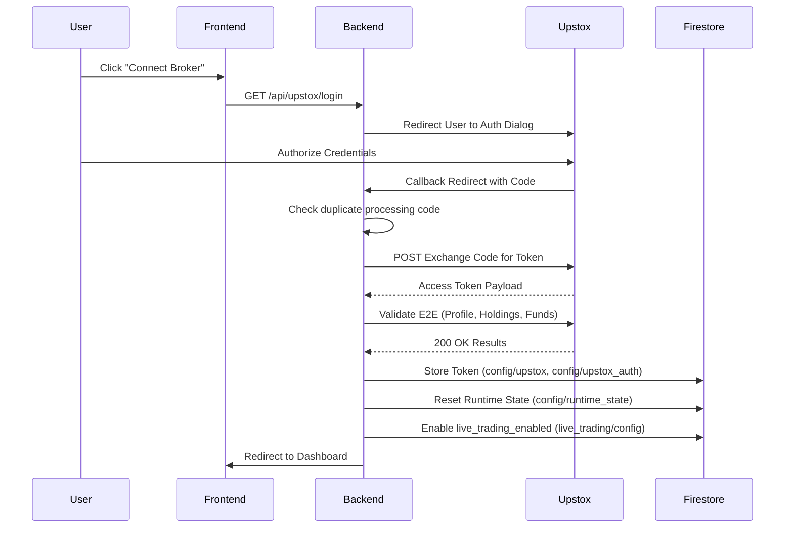
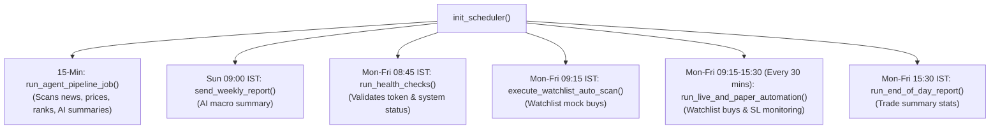
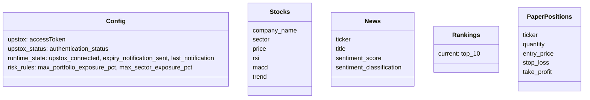
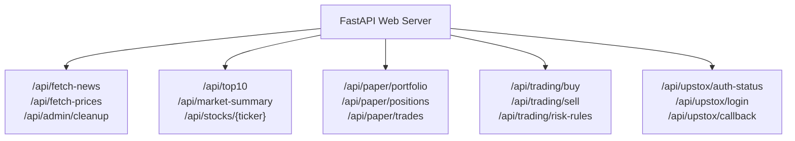
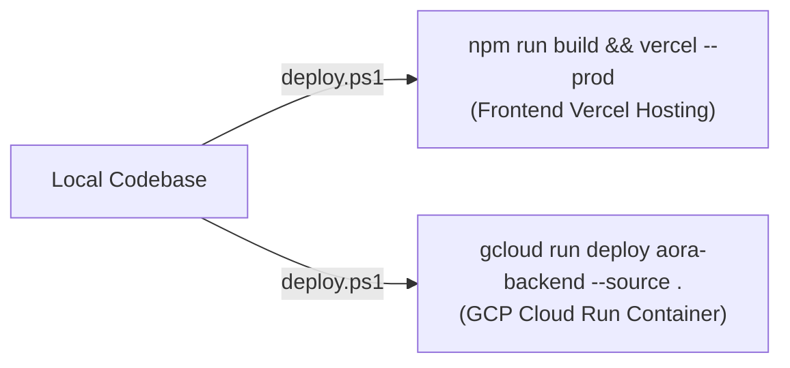
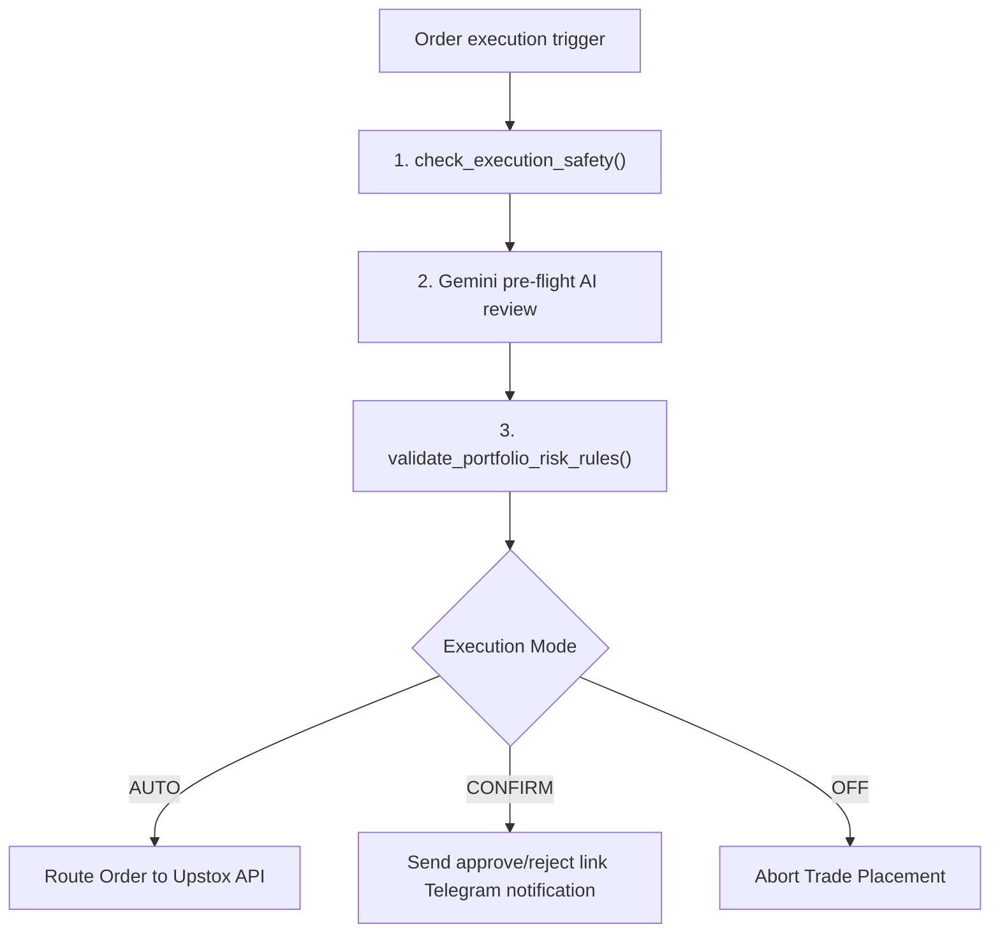

# AORA: Apex Stock Intelligence Engine

<div align="center">

[](https://fastapi.tiangolo.com)
[](https://react.dev)
[](https://www.typescriptlang.org)
[](https://deepmind.google/technologies/gemini)
[](https://firebase.google.com)
[](https://opensource.org/licenses/MIT)

<h3>A production-grade, multi-agent AI Stock Valuation & Automated Trading platform. Built for the Indian Stock Market.</h3>

[System Architecture](./docs/architecture.md) • [API Guide](./docs/api_reference.md) • [Firestore Schema](./docs/firestore_schema.md) • [AI Agents Guide](./docs/ai_agents.md) • [Telegram Setup](./docs/telegram_integration.md) • [Developer Guide](./docs/developer_guide.md) • [Installation Guide](./docs/installation.md)

</div>

---

## 🖥️ System Mockup Landing Page

```
┌────────────────────────────────────────────────────────────────────────┐
│  AORA AI ── Stock Leaderboard                                  [⚙️ Mode]│
├────────────────────────────────────────────────────────────────────────┤
│  [Market Regime: Bearish]   [Nifty 50: 22,140.20]   [Nifty Bank: 47,210]│
├────────────────────────────────────────────────────────────────────────┤
│  Leaderboard                                                           │
│  Rank  Ticker   Score   Price      Change   Sentiment   AI Explanation │
│  ────  ──────   ─────   ─────      ──────   ─────────   ────────────── │
│  #1    TCS      8.75    ₹3,850.50  +1.25%   🟢 Bullish  Strong cash fl…│
│  #2    INFY     8.42    ₹1,420.00  +0.85%   🟢 Bullish  RSI rebound at…│
│  #3    RELIANCE 7.95    ₹2,910.15  -0.30%   🟡 Neutral  Support area h…│
│                                                                        │
├────────────────────────────────────────────────────────────────────────┤
│  Broker status: CONNECTED (2h 15m age)         [Reconnect Broker]     │
└────────────────────────────────────────────────────────────────────────┘
```

---

## 📊 Flowcharts & Topologies

### 1. Overall System Architecture
Decoupled multi-tier cloud and serverless configuration:


---

### 2. Cooperative AI Agent Pipeline
Sequentially chained pipeline executing every 15 minutes:

```mermaid
graph LR
    Collector["1. News Collector\n(Scrapes RSS Feeds)"] -->|Matched News| Sentiment["2. Sentiment Agent\n(Gemini Sentiment Math)"]
    Sentiment -->|Scores & Trends| Technical["3. Technical Agent\n(RSI, MACD Poller)"]
    Technical -->|Price & Indicators| Scorer["4. Scorer Agent\n(Weighted Rank Aggregation)"]
    Scorer -->|Leaderboard rankings| Explanation["5. Explanation Agent\n(Gemini explanation compiler)"]
    Explanation -->|Investment Memos| Alert["6. Alert Agent\n(Fires Telegram Alerts)"]
    Alert -->|Notification Telemetry| Learning["7. Learning Agent\n(Weight Optimization Loops)"]
```



---

### 3. Broker Authentication Flow
Redundancy-filtered Upstox v2 OAuth validation sequence:



---

### 4. Background Scheduler Flow
AP scheduler and Cron intervals running in the background:



---

### 5. Firestore Database Schema
NoSQL document schemas and config layouts:



---

### 6. API Routing Diagram
Decoupled endpoints organization:



---

### 7. Deployment Pipeline
Vercel + Google Cloud Run serverless build and deploy:



---

### 8. Trading Workflow & Safeguards
Rule validations and risk checkers sequence:



---

## 🛠️ Multi-OS Setup Checklist

See the [Installation Guide](./docs/installation.md) for full configurations.

### Windows (PowerShell)
```powershell
# Navigate to backend
cd backend
python -m venv venv
.\venv\Scripts\Activate.ps1
pip install -r requirements.txt
cp .env.example .env
# Place your serviceAccountKey.json inside backend/

# Start development
python -m uvicorn app.main:app --port 8000 --reload
```

### Linux & macOS
```bash
cd backend
python3 -m venv venv
source venv/bin/activate
pip install -r requirements.txt
cp .env.example .env

python3 -m uvicorn app.main:app --port 8000 --reload
```

---

## 🔐 Environment Variables (.env)

See the [Installation Guide](./docs/installation.md) for details.

| Variable Name | Required | Default / Example | Purpose |
|---|---|---|---|
| `GEMINI_API_KEY` | **Yes** | `AIzaSy...` | API key to authorize Gemini 2.5 Flash models |
| `TELEGRAM_BOT_TOKEN` | No | `12345:AA...` | Bot token provided by @BotFather |
| `TELEGRAM_CHAT_ID` | No | `-10012...` | Chat identifier for alert routing |
| `UPSTOX_API_KEY` | No | `prod-api-key` | Broker API key |
| `UPSTOX_SECRET` | No | `prod-secret` | Broker client secret |
| `UPSTOX_REDIRECT_URI` | No | `http://localhost:8000/api/upstox/callback` | OAuth redirect URI |
| `DASHBOARD_URL` | No | `http://localhost:3000` | Redirect portal link for authentication callbacks |

---

## 🚀 REST API Usage Examples

See the [API Guide](./docs/api_reference.md) for payload models.

### Fetch Scored Top 10 Leaderboard
```bash
curl -X GET "http://localhost:8000/api/top10" -H "accept: application/json"
```

### Submit Live Buy Order
```bash
curl -X POST "http://localhost:8000/api/trading/buy" \
     -H "Content-Type: application/json" \
     -d '{"ticker": "INFY", "quantity": 10, "price": 1420.00, "transaction_type": "BUY"}'
```

---

## 🛠️ Troubleshooting Manual

### 1. Spam alert loops on expired broker sessions
* **Symptom**: Telegram bot continuously notifies that Upstox session has expired.
* **Fix**: The system has been upgraded to write authentication states in `config/runtime_state`. If the session is invalid, `expiry_notification_sent` becomes `True` to block additional messages, respecting a 24-hour rate limit. Reconnect at `/api/upstox/login` to reset the flag.

### 2. Available Margin Deficiency
* **Symptom**: Simulated or live trades reject with margin alerts.
* **Fix**: The Risk Engine checks your available cash balance before placing trades. Review the rules or adjust your trade sizes inside the **Risk Configuration Editor** card panel in the UI.

---

## 💳 Cost Optimization & API Caching

* **Dynamic Cache Layer**: Leaders and scores feeds are kept cached memory-wide for 15 minutes. This reduces database reads when multiple tabs are open.
* **Static Database Reads**: Leaderboard rankings reads point directly to the static `rankings/current` collection instead of executing the full 7-agent pipeline on each page load.
* **Gemini Throttle**: News sentiment analysis compiles matches and checks token counts before running to minimize Google Generative AI quota consumption.

---

## 🤝 Contribution Guide

See the [Developer Guide](./docs/developer_guide.md) for extension manuals.
1. Fork the repository.
2. Create a feature branch: `git checkout -b feature/amazing-feature`.
3. Verify that all tests pass: `python -m unittest backend/test_auth_notifications.py`.
4. Commit your changes and open a Pull Request.

---

## 📄 License

Distributed under the MIT License. See [LICENSE](LICENSE) for details.
