# Apex Stock Intelligence Engine: AI Agents & Prompts

AORA utilizes a multi-agent cooperative architecture powered by Gemini 2.5 Flash to retrieve news, analyze sentiment, compute valuations, explain scoring, and perform pre-flight risk checks.

---

## 1. Cooperative Agent Pipeline

The core analytical pipeline divides tasks among 7 specialized agents:

```mermaid
graph LR
    Collector[1. news collector] -->|Scraped Articles| Sentiment[2. Sentiment Agent]
    Sentiment -->|Scores & Trends| Technical[3. Technical Agent]
    Technical -->|Price & Indicators| Scorer[4. Scorer Agent]
    Scorer -->|Rankings Leaderboard| Explanation[5. Explanation Agent]
    Explanation -->|Reasoning & Explanations| Alert[6. Alert Agent]
    Alert -->|User Notifications| Learning[7. Learning Agent]
```



1. **News Collector Agent** (`news_collector.py`): Periodically scrapes financial feeds. Matches ticker search terms to articles.
2. **Sentiment Agent** (`sentiment.py`): Submits matched articles to Gemini Flash. Evaluates structural sentiment classification (-1.0 to 1.0) and lists news impact.
3. **Technical Agent** (`technical.py`): Polls historical prices and calculates indicator values (RSI, MACD, SMA/EMA moving averages).
4. **Scorer Agent** (`ranking.py`): Implements a weighted rank aggregation formula:
   $$\text{Score} = (W_{\text{sentiment}} \times S_{\text{sentiment}}) + (W_{\text{tech}} \times S_{\text{tech}}) + (W_{\text{mom}} \times S_{\text{mom}})$$
5. **Explanation Agent** (`explanation.py`): Takes the scored rankings. Queries Gemini Flash to generate descriptive growth catalysts and investment rationales for the Top 10 stocks.
6. **Alert Agent** (`alert.py`): Evaluates user trigger conditions. Sends alerts to the Telegram bot channel.
7. **Learning Agent** (`learning_agent.py`): Performs EOD trade feedback evaluations. Evaluates previous recommendations against actual price performance to adjust scoring coefficients.

---

## 2. Gemini Prompts & Prompt Engineering

Below are details of the custom prompt templates and configuration settings used to guide the Gemini model.

### 2.1 Sentiment Analysis Prompt
```
You are an expert financial analyst. Analyze the following news article for the stock ticker: {ticker}.
Article Title: {title}
Article Summary/Content: {content}

Output a valid JSON object matching this schema exactly:
{{
  "sentiment_score": float (between -1.0 for highly bearish and 1.0 for highly bullish),
  "sentiment_classification": "positive" | "negative" | "neutral",
  "reasoning": "Brief explanation of the sentiment assessment and potential market impact."
}}
```

### 2.2 Growth catalysts Explanation Prompt
```
You are a senior investment committee director. Compile an investment memo explaining why the stock {ticker} ({company_name}) has achieved a top ranking in our intelligence leaderboard.
Technical Indicators:
- Price: {price}
- RSI: {rsi}
- MACD: {macd}
- Trend: {trend}
News Sentiment: {sentiment_score} (Classification: {sentiment_classification})

Output a concise, professional summary (max 3 sentences) explaining the key catalysts, technical setups, and near-term catalysts for growth.
```

### 2.3 Pre-Flight Trade Review Prompt
* **Location**: `backend/app/services/ai_trade_review.py`
* **Purpose**: Before triggering live or simulated order executions, Gemini Flash checks the setup's quality:
```
Analyze this trade suggestion:
Action: {transaction_type}
Ticker: {ticker}
Current price: {price}
Proposed size: {qty} shares
Portfolio Exposure: {exposure_pct}%
Technical Regime: {regime}

Verify if this trade meets sound capital allocation guidelines. Identify potential risks, entry/exit thresholds, and outputs a confidence score (0 to 100) along with a decision to 'APPROVE' or 'REJECT'.
```

---

## 3. Position Sizing & Safety Layer

In addition to pure AI recommendations, a deterministic mathematical safety layer is enforced:
* **Position size caps**: No single stock can exceed the maximum percentage (default: 20%) of the total portfolio value.
* **Volatility Adjustment**: Order sizes are dynamically adjusted using the Average True Range (ATR) indicator:
  $$\text{Quantity} = \frac{\text{Risk Capital}}{\text{ATR} \times \text{Multiplier}}$$
* **Leverage Breaker**: Order executions are aborted if the Upstox API reports available margin is lower than the required margin.
