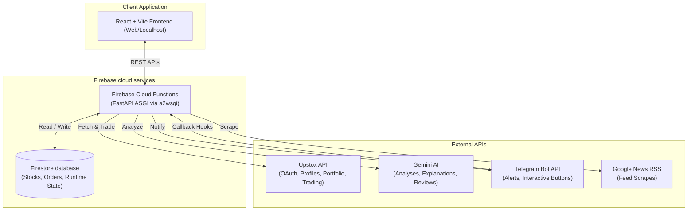

# Apex Stock Intelligence Engine: System Architecture

This document describes the overall system architecture, data models, processing pipelines, and system configuration for the Apex Stock Intelligence Engine (AORA).

---

## 1. System Overview

AORA (Apex Stock Intelligence Engine) is a production-grade AI-assisted trading and portfolio management platform tailored for the Indian stock market. It operates in three execution modes:
* **OFF**: No automated orders or trade suggestion analysis.
* **CONFIRM (Assisted Trading Mode)**: AI agent scanner processes market tickers, checks risk limits, sends telegram review alerts with callback links, and routes trades to Upstox API only after user validation.
* **AUTO (Auto Trading Mode)**: System automatically runs scans, matches rules, reviews setups with Gemini Flash, and routes execute trades directly to the broker without manual intervention.

---

## 2. Technology Stack

The platform is divided into a high-performance Python ASGI backend and a modern React web frontend.

| Layer | Component | Technology | Version / Notes |
|---|---|---|---|
| **Frontend** | Framework | React (Vite) | React v19, TypeScript v6, Vite v5 |
| | Styling | Vanilla CSS / Tailwind | CSS Custom Variables, Tailwind v4 |
| | Charts | Lightweight Charts | TradingView charts wrapper |
| | Icons | Lucide React | Modern visual indicators |
| **Backend** | API Web server | FastAPI | FastAPI v0.111.0, Starlette v0.37.2 |
| | ASGI Wrapper | a2wsgi | ASGI to WSGI adapter wrapper (for serverless Cloud Functions) |
| | Server | Uvicorn | Uvicorn v0.30.1 |
| **Database** | Core Data Store | Firebase Firestore | NoSQL Document Store |
| **AI Engine** | Large Language Model| Gemini 2.5 Flash | via `google-generativeai==0.7.0` |
| **Broker API** | Live execution | Upstox API v2 | REST & JSON profiles, holdings, and funds endpoints |
| **Messaging** | Alert gateway | Telegram Bot API | Direct HTTP webhooks and sendMessage endpoints |
| **Cron Scheduling**| Scheduler engine | APScheduler / Firebase Cron | Local scheduler wrapper + Cloud Functions triggers |

---

## 3. High-Level System Architecture

AORA's system topology follows a decoupled serverless architecture hosted on Google Cloud Platform (GCP) or local containers. The FastAPI backend is wrapped inside a Cloud Function using `a2wsgi` middleware to handle web requests and cron loops.

---

## 4. Decoupled Data Flow Pipelines

The AORA backend runs two primary pipelines:

### 4.1 Stock Analysis & Valuation Pipeline (Cron Job)
This pipeline triggers automatically during market intervals (or manually via `/api/analyze-stocks`).

1. **News Collector Agent**: Scrapes financial RSS feeds (Google News, Economic Times, Moneycontrol) for registered stock symbols. Matches news to tickers.
2. **Sentiment Agent**: Sends matched news text to Gemini 2.5 Flash to output a sentiment classification score (-1.0 to 1.0) and impact assessment.
3. **Technical Agent**: Polls price data, calculates indicators (RSI, MACD, SMA, EMA, ATR, support/resistance levels).
4. **Scorer Agent**: Applies a multi-criteria ranking algorithm combining sentiment scores, technical indicators, and momentum indicators.
5. **Explanation Agent**: Uses Gemini Flash to compile textual explanation rationales for the top 10 stocks.
6. **Alert Agent**: Dispatches Telegram notifications to the user for newly discovered stock setups.
7. **Learning Agent**: Computes post-trade feedback to tune scoring parameters.

### 4.2 Automated Trading & Monitoring Pipeline (Scheduled: 30m)
This pipeline runs every 30 minutes during market hours.

1. **Watchlist Opportunities Scanner**: Checks the ranked list. If a stock fits target metrics and the safety threshold:
   * Triggers Gemini Pre-Flight Trade Review to evaluate setups and sizes.
   * Runs the **Risk Engine** to validate maximum portfolio caps (80%), sector caps (40%), single stock caps (20%), and cash availability.
   * If `AUTO` mode is enabled, routes a market or limit order to Upstox.
   * If `CONFIRM` mode is enabled, registers a pending order in Firestore and sends a Telegram alert with `Approve` and `Reject` link callbacks.
2. **Holdings Monitor**: Compares active positions against Trailing Stop Loss (TSL) and Target Profit levels. If crossed, it fires exit orders in `AUTO` mode or Telegram alerts in `CONFIRM`/`OFF` mode.

---

## 5. Security & Safety Layer

* **No Hardcoded Access**: Upstox OAuth session tokens are fetched dynamically from Firestore `/config/upstox_auth` and kept memory-cached.
* **Failsafe Circuit Breakers**:
  * If token validation fails, the system immediately switches `live_trading_enabled` to `False` in Firestore to prevent corrupted API routing.
  * Ensures that only one Telegram alert is fired per session expiry, implementing a 24-hour rate limit cooldown.
* **Risk Engine Guardrails**: The risk engine actively prevents buying power over-leveraging, keeps cash reserves untouched, and enforces strict single-stock and sector exposure caps.
